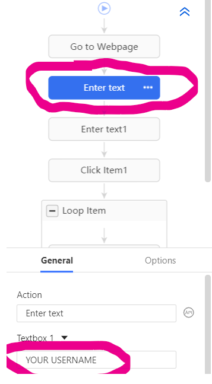

# MÖK App - terjesztési  & karbantartási infók

## Disztributálás

Jelenleg az app egyetlen terjesztési platformja a Google Play, ahol egy **Zárt tesztelés - Alpha** nevű zárt tesztelési csatornán tesszük közzé mindig a legfrissebb verziót. A csatornához két Google-csoport tagjai férhetnek hozzá; a mökösök és a premökösök. 

**Fontos: attól, hogy valaki tagja valamelyik csoportnak, elvileg még nem fogja automatikusan látni az appot Playen, ehhez a csatorna *Tesztelők* fülén alul található linkre kell nyomnia.** Van egy *Mök app útmutató* nevű [pdf](https://drive.google.com/file/d/1eMaKQr0us9mFG9qGp9zOppQC-xfoefIE/view) (és [Google doksi](https://docs.google.com/document/d/1oqiUdERlxIFXEY-pgikNSeupS-pza2KINxd7jSDis0A/edit)) a Drive-on, ebben található a telepítés mikéntje és a link is. Ha egy fiók tulajdonosa rákattintott egyszer a linkre (és telepítette is az appot?), onnantól neki meg fog jelenni a Playen az app, innentől nem szükséges neki a link.

## Új verzió kiadása

Az AppCircle jelenleg úgy van bekonfigurálva, hogy minden push (vagy PR) a master branchre automatikusan lebuildeli az appot és feltölti Google Play Console-ba. Ez még nem válik automatikusan elérhetővé, mint frissítés, ehhez a következő lépéseket kell követni:

*Fontos megjegyzés: a folyamat ezen része mindig egy kicsit káoszos és ráadásul pont most változott, szóval nincs rá garancia, hogy az alábbiak pontosan működnek.*

0) Növeled az appszintű build.gradle-ben a *versionName* változót a [semantic versioning](https://semver.org/) szabályai alapján (röviden: minor.mayor.patch, pl. 3.0.1). Ha ez kimarad, ugyanúgy felmegy majd a frissítés, csak nehezebben lesz követhető, hogy kinek milyen verzió van telepítve. 
1) Elkészíted a kiadni kívánt verziót a **develop** branchre, megbizonyosodsz róla, hogy rendesen működik, majd a developot egy PR-ral a **master**be mergeled.
2) Az AppCircle automatikusan lebuildeli az appot és feltölti a Google Play Console-ba. Ez akár 15-20 perc is lehet a sikeres buildtől számítva, légy türelmes. Ha nem sikerült buildelnie, akkor nem jó az app jelenlegi állapota. Kezdd újra az egészet.
3) Innentől már csak meg kell várni, hogy a Google ellenőrizze az új verziót, ez általában max fél óra, de akár 1-2 nap is lehet. Ha ez lefutott, akkor az alkalmazás automatikusan elérhetővé válik és mindenki tud frissíteni rá, aki az adott csatornát használja.

### Karbantartás

Jelenleg egy dolog van, amit néha meg kell csinálni "kézzel"; ez pedig a telefonszámok felvitele az adatbázisba. A legfrissebb adatok a telefonszámokról a honlapon találhatóak (ezt tekintjük SSoT-nak), mivel azonban ez mindig kézzel kerül frissítésre, nem pedig egy adatbázisból, ezért jobb ötlet híján a néz ki a folyamat: 

1) Lescrapeljük a honlapról a telószámokat
2) Feltöltjük őket Firebase-re a megfelelő személy dokumentumába

Mivel egy felhasználónak akkor jön létre dokumentum, amikor először regisztrál az appba, ezért a következő folyamatot mindig meg kell ismételni, amikor (releváns mennyiségű) új tag regisztrál az appba.
A scrapelés egy Octoparse nevű program segítségével megy. 

A folyamat részletesen:

1) Töltsük le az [Octoparse](https://www.octoparse.com/download/windows)-t
2) Octoparse-ban a Dashboard fület megnyitva drag-and-dropoljuk a git repóban található *phonenumbers/Mök-tagok telefonszámai.otd* nevű fájlt
3) A workflow-on jobb oldali három pötty -> settings -> more settings -> edit workflow
4) Ezt követően a jobb oldali panelen a felső *Enter text* dobozra kattintva írd át a lenti *Textbox 1* mező értékét a **medvematek.hu-s felhasználónevedre**. A szerkesztés után kattints a jobb lenti *Apply* gombra. A bejelentkezési adatok megadása azért kell, mert a tagok adatai nem elérhetőek nyilvánosan a honlapon, csak login után. Nyugi, nem adjuk el orosz hackereknek az adataidat. 

5) Ismételd meg ugyanezt az eggyel lentebbi *Enter text1* feliratú dobozzal is. Ide a medvematek.hu-s jelszavadat írd. 
6) Ha ez kész, a jobb fenti *Run* gombra, majd felugró ablak bal oldali (azaz *Run on your device*-nél levő) *Standard mode* gombra kattints. Ekkor kezdődik el a scrapelés.   
7) Ha a scrapelés elkészültével felugró popup azt írja, hogy "no data has been extracted", akkor valami félrement, nézd meg, hogy jól írtad-e be az adataidat és elmentetted-e őket. Ha megváltozott az oldal struktúrája azóta, az is gondot jelenthet. 

Per pill nekem se működik ez valamiért, amúgy is google-ből kéne a telószámokat venni, majd fixáljuk xd

### További potenciális terjesztési módszerek

A Firebase elvileg csak azokkal az alkalmazásokkal működik, amiknek megadtuk előzetesen az SHA fingerprintjét. A Google Playre feltöltött appoknak ez automatikusan generálódik, szóval egyszer kellett csak beírni a Firebase-be ezt, azóta működik a Playre feltöltött verziókkal. Viszont ha nem (csak) Playen terjesztjük az új verziót, akkor sanszos, hogy nem fog működni, hacsak be nem írjuk Firebase-be az új SHA fingerprintet. Ezért szerintem kicsit körülményes a lenti módszereket használni, plusz ha elfelejtődik a fingerprint beírása, akkor csodálkozni fogunk, hogy miért nem megy az app. Ha esetleg valakinek mégis szüksége lenne rá a továbbiakban, akkor hajrá.

Az [AppCircle](https://my.appcircle.io/dashboard) nevű CI/CD tool, amit használunk, lehetőséget nyújt két további terjesztési módszerre is; egyrészt el lehet küldeni automatikusan emailben előre meghatározott személyeknek a frissítést, másrészt létezik egy ún. [Enterprise App Store-ja](https://e49pp5xye21y.store.appcircle.io/) is, ahova fel lehet tölteni egy kattintással az appot. Ez esetleg azoknak lehet hasznos, akik emulátorról használják az appot.

Ezen kívül a Firebase-nak is van egy *Firebase app distribution* nevű szolgáltatása, bár ez kifejezetten a tesztelőkhöz való eljuttatásra való szerintük.

## Kérdések

Ha valami nem pont úgy működik, ahogy az a fentiekben írva van, szerkeszd nyugodtan a doksit.

Ha bármilyen kérés, kérdés felmerül benned, akkor keresd bármikor és bárhol engem (Olivér) vagy Zalánt. Ha hibát találtál, nyiss új issue-t, amit a megfelelő labellel ellátsz. :)